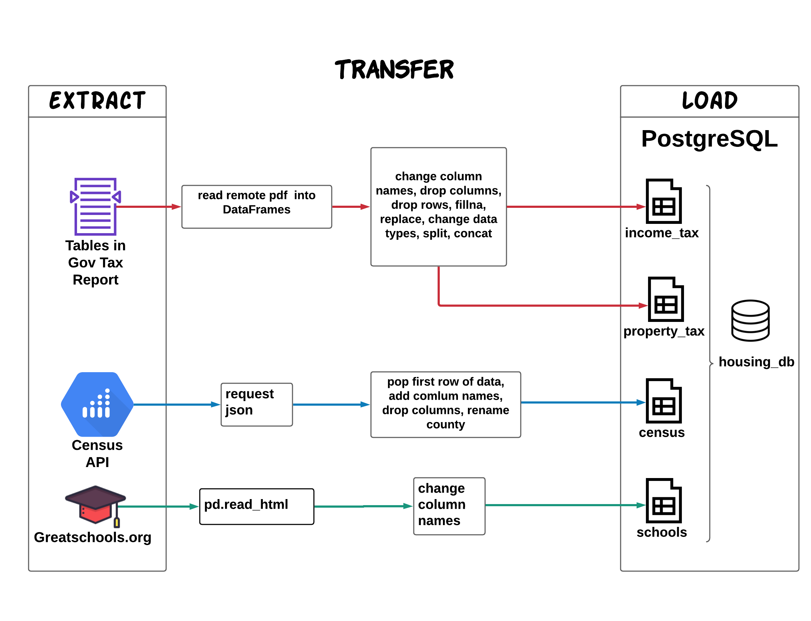

# ETL-project

## Context

Education and housing are closely related in our socio economic life. In this project, we extracted data on those fields from three different resources: Ohio Tax Information, Census API on Social (DP02), Economic(DP03), and Housing(DP04) Characteristics of Ohio (state:39) Counties (88 total), and Greatschools.org. The gathered data will then be cleaned and transformed into a PostgreSQL database.

## Data Cleanup & Analysis

Perform ETL on the data and document the following:


- The sources of data that we extracted from.
  * [American Community Survey 5-Year Data (2009-2019)](https://www.census.gov/data/developers/data-sets/acs-5year.html)
  ```python
  census_variables_dict={"NAME":"county_name",
                         "DP02_0001E":"total_households",
                         "DP02_0016E":"average_household_size",
                         "DP02_0087E":"total_population",
                         "DP02_0151E":"computers_and_internet_use_total_households",
                         "DP02_0053E":"population_3yr_and_over_enrolled_in_school",
                         "DP02_0062E":"educational_attainment_hs",
                         "DP03_0062E":"median_houshold_income",
                         "DP03_0063E":"mean_household_income",
                         "DP03_0120E":"educational_attainment_hs",
                         "DP04_0004E":"homeowner_vacancy_rate",
                         "DP04_0089E": "owner_median_price",
                         "DP04_0110E":"household_w_mortgage_num",
                         "DP04_0117E":"household_wo_mortgage_num",
                         "DP04_0134E": "renter_median_price",
                         "DP04_0136E":"renters_num"}
  ```
  * [Ohio School districts with city and county name](https://www.greatschools.org/schools/districts/Ohio/OH/)
  * [Ohio Tax Annual Report 2020](https://tax.ohio.gov/static/communications/publications/annual_reports/2020annualreport.pdf)
- The type of transformation needed for this data :cleaning, joining, filtering, concatenating, reset index, change datatype, etc.
- The final production database to load the data into is relational PostgreSQL.
- The final tables that are used in the housing_db database:
  - schools, census, income_tax, property_tax   

## Structure (progresql tables under housing_db)
**census table**

  - Primary:
    - county_name varchar(20)
  - Numerical:
     - total_households numeric(15)
     - average_household_size numeric(15)
     - total_population numeric(15)
     - computers_and_internet_use_total_households numeric(15)
     - population_3yr_and_over_enrolled_in_school numeric(15)
     - educational_attainment_hs numeric(15)
     - median_household_income numeric(15)
     - mean_household_income numeric(15)
     - homeowner_vacancy_rate numeric(6,2)
     - owner_median_price numeric(15)
     - household_w_mortgage_num numeric(15)
     - household_wo_mortgage_num numeric(15)
     - renter_median_price numeric(15)
     - renters_num numeric(15)

**schools table**

  - Primary:
    - id serial
  - Non-numerical:
    - district_name text 
    - city varchar(30) 
    - county_name varchar(20) 

**income_tax**

  - Primary:
    - county_name varchar(20)
  - Numerical:
    - num_of_returns numeric(15)
    - fed_agi numeric(15)
    - oh_income_tax_liability numeric(15)

**property_tax**

  - Primary:
    - county_name varchar(20)
  - Numerical:
    - class_1_taxable_value numeric(15)
    - class_2_taxable_value numeric(15)
    - total_taxable_value numeric(15)
    - class_1_effective_rate numeric(6,2)
    - class_2_effective_rate numeric(6,2)
    - taxes_charged numeric(15)
    - non_business_credit numeric(15)
    - owner_occupied_credit numeric(15)
    - exemption_reduction numeric(15)
    - net_taxes_charged numeric(15)
    - net_effective_tax_rate numeric(6,2)

## Limitations of the dataset

Data are published in 2020 or 2019.

## Copyright &copy;
**Staci Wilson, Yang Shi, Josh Podl**